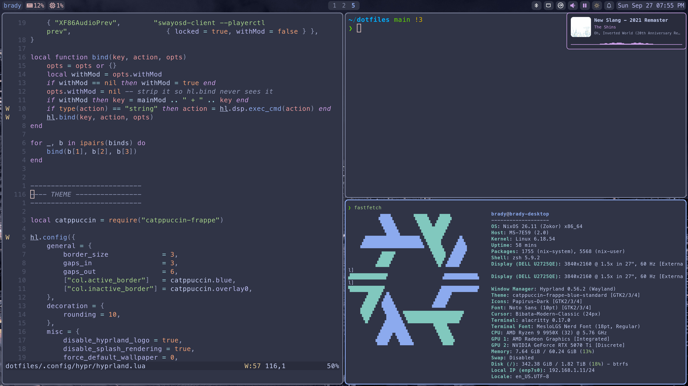
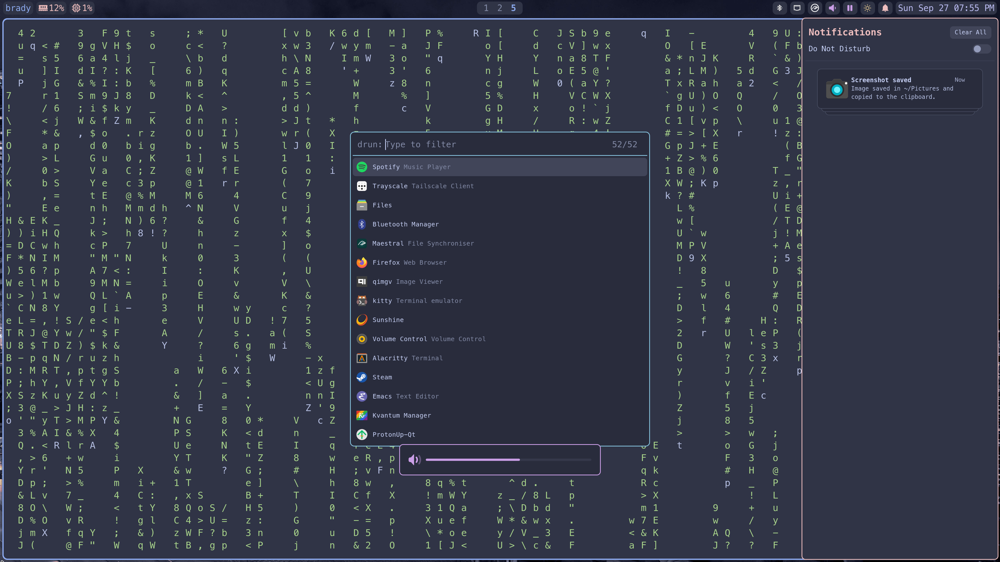

# dotfiles

My dotfiles for Linux and macOS.





## Some tools I use

- [Neovim](https://neovim.io): main text editor
- [Spacemacs](https://www.spacemacs.org/): for Org mode
- [Hyprland](https://hypr.land/) or [Aerospace](https://github.com/nikitabobko/AeroSpace): tiling window manager
- [Alacritty](https://alacritty.org/): terminal emulator
- [lazygit](https://github.com/jesseduffield/lazygit): git ui
- [zoxide](https://github.com/ajeetdsouza/zoxide): `cd` alternative
- [fzf](https://github.com/junegunn/fzf): fuzzy finder
- ...

## Usage

### With Nix (Home Manager)

- Install [Nix](https://nixos.org/download/)
- Clone this repo as "~/dotfiles"
  ```sh
  git clone https://github.com/bradybhalla/dotfiles.git ~/dotfiles
  ```
- Set up home manager
  ```sh
  home-manager switch --flake .#<user>@<host>
  ```

### Without Nix

Install programs with your package manager of choice, then copy files from "dotfiles/" into your home directory. Note that this will be missing dotfiles for programs that are configured entirely through home manager.
